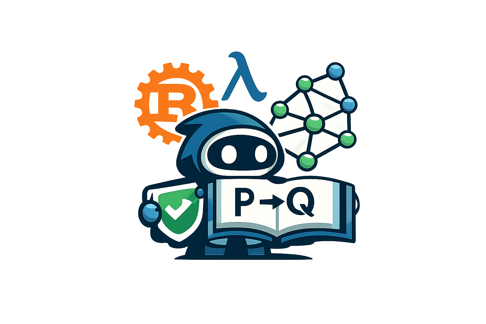

# Axiograph



**Runtime-typed ontology engineering for software, business rules, semantic VCS,
and proof-carrying high-value claims.**

Axiograph is a greenfield typed ontology workbench built around one public
semantic spine:

```text
canonical .axi
  -> KernelModuleIr
  -> SchemaCategoryIr + TheoryIr + InstanceFunctorIr
  -> KernelSurfaceV1 refs
  -> typed runtime reports
  -> optional Lean verifier
```

The accepted `.axi` module is the reviewable meaning plane. Runtime storage,
graph backends, embeddings, LLM outputs, and generated code are derived or
advisory surfaces until they are lowered through the compiled IR and accepted by
the semantic workflow.

## What It Is For

- Author typed ontologies with relation-as-object semantics, projection roles,
  equations, rewrites, constraints, contexts, and worlds.
- Check runtime theory obligations with explicit anchors, closure tiers,
  residual obligations, and non-claims.
- Run typed queries and competency questions over canonical modules, with
  optional Lean-checked certificates for supported fragments.
- Co-evolve ontology and code through DDD/fDDD overlays, behavior cases,
  continuous semantic coverage, and codegen plans.
- Review semantic changes with branch/tag style semantic VCS, typed merge and
  rebase plans, resolver handles, CQ gates, trust gates, and Lean conformance
  checks for finite operational fragments.
- Use embeddings, RDF/SHACL, TypeDB, TerminusDB, PathDB, and LLM/MCP tools as
  adapters or evidence/projection layers, not as ontology authority.

## Trust Boundary

- **Rust** is the operational runtime: parsing, elaboration, querying,
  projections, coverage, authoring flows, diagnostics, and report generation.
- **Lean** is the trusted checker for selected certificate/gate fragments.
- **PathDB** and `.axpd` are derived execution formats.
- **Graph DB projections** are native-readable read surfaces; mutation authority
  stays in Axiograph.
- **Embedding/LLM output** is evidence or proposal material until promoted
  through typed review.

A verified certificate proves a narrow claim under explicit anchors and
assumptions. It does not prove source truth, query completeness, global ontology
closure, or full HoTT semantics.

## Quick Start

Validate a canonical module:

```bash
cargo run --manifest-path rust/Cargo.toml -p axiograph-cli -- \
  check validate examples/Family.axi
```

Run a runtime theory check:

```bash
cargo run --manifest-path rust/Cargo.toml -p axiograph-cli -- \
  check theory examples/ontology/OntologyRewrites.axi \
  --closure-tier finite_fragment \
  --json \
  --out build/readme/ontology_rewrites_theory_check.json
```

Emit a typed query certificate from canonical `.axi`:

```bash
cargo run --manifest-path rust/Cargo.toml -p axiograph-cli -- \
  cert query examples/manufacturing/SupplyChainHoTT.axi \
  --lang axql \
  'select ?to where name("RawMetal_A") -Flow-> ?to limit 10' \
  --out build/readme/supply_chain_query_cert.json
```

Run the software-authoring DDD/fDDD flow:

```bash
./examples/software_authoring/run_authoring_flow.sh
```

Run the semantic merge/rebase flow:

```bash
./examples/semantic_merge/run_merge_flow.sh
make verify-lean-semantic-vcs
```

Run the current canonical-spine gate:

```bash
make verify-canonical-spine
```

## Main User Paths

| Goal | Start Here |
| --- | --- |
| Learn the current workflow | `docs/howto/CANONICAL_SEMANTIC_SPINE.md` |
| Understand the architecture | `docs/explanation/SYSTEM_OVERVIEW.md` |
| Use examples | `examples/README.md` |
| Run tests | `docs/howto/TESTING.md` |
| Verify certificates and Lean gates | `docs/howto/FORMAL_VERIFICATION.md` |
| Work on compiled IR | `docs/reference/KERNEL_IR.md` |
| Work on runtime theory checking | `docs/reference/RUNTIME_THEORY_CHECKER.md` |
| Work on semantic VCS and merge | `docs/reference/SEMANTIC_VCS.md` |
| Work on software authoring/codegen | `docs/reference/SOFTWARE_AUTHORING_TOOLS.md` |
| Work on embeddings and evidence | `docs/reference/EMBEDDINGS_AND_EVIDENCE.md` |

## Example Catalog

- `examples/Family.axi` — minimal typed ontology.
- `examples/ontology/OntologyRewrites.axi` — equations, rewrites, and runtime
  theory obligations.
- `examples/semantic_merge/` — plant-operations semantic VCS merge/rebase.
- `examples/software_authoring/` — pure domain `.axi` plus DDD/fDDD overlays,
  weak definition queries, continuous coverage, and codegen previews.
- `examples/industrial/RegulatedProductionLine.axi` — process, certification,
  and operational/business constraints.
- `examples/physics/` — scientific ontology and measurement modeling.
- `examples/rdfowl/` — RDF/SHACL boundary adapters.

## Development

Prerequisites:

- Rust stable.
- Lean 4 + Lake for verifier work.
- Docker only for optional backend projection/container smoke tests.

Common checks:

```bash
cargo fmt --manifest-path rust/Cargo.toml --check
cargo check --manifest-path rust/Cargo.toml -p axiograph-cli -p axiograph-pathdb
lake build Axiograph.VerifyMain
git diff --check
```

## License

PolyForm Perimeter License 1.0.1
